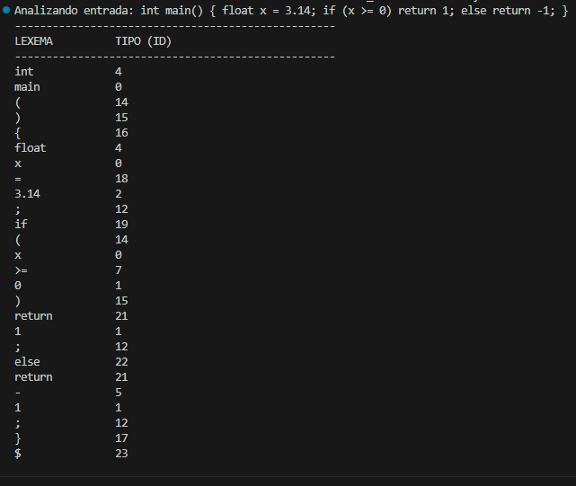

# Etapa: Analizador Léxico Completo

## Descripción
En esta etapa se presenta la implementación completa del módulo léxico (Scanner) del compilador. El programa es capaz de leer una fuente de entrada y transformar la secuencia de caracteres en una lista de tokens, asignando a cada uno el **ID numérico** especificado en la tabla de requisitos del proyecto.

## Tabla de Símbolos Implementada
El analizador reconoce y clasifica los siguientes elementos con sus respectivos valores de retorno:

| Símbolo / Token | Tipo (ID) | Ejemplo |
| :--- | :--- | :--- |
| Identificador | 0 | `variable`, `main` |
| Entero | 1 | `10`, `500` |
| Real | 2 | `3.14`, `0.5` |
| Tipos de dato | 4 | `int`, `float`, `void` |
| Op. Adición | 5 | `+`, `-` |
| Op. Multiplicación | 6 | `*`, `/` |
| Op. Relacionales | 7 | `<`, `<=`, `>`, `>=` |
| Op. Lógicos | 8, 9, 10 | `||`, `&&`, `!` |
| Op. Igualdad | 11 | `==`, `!=` |
| Delimitadores | 12-17 | `;`, `,`, `(`, `)`, `{`, `}` |
| Asignación | 18 | `=` |
| Palabras Reservadas | 19-22 | `if`, `while`, `return`, `else` |
| Fin de entrada | 23 | `$` |

## Archivos Entregados
* `lexico.cpp`: Código fuente en C++ que contiene la lógica del autómata y la función principal de prueba.
* `evidencia.png`: Captura de pantalla de la ejecución.

## Pruebas de Ejecución
Se sometió al analizador a una entrada de código que contiene una mezcla de estructuras de control, declaraciones, asignaciones y operaciones aritméticas para validar la cobertura total de la tabla de tokens.

**Entrada de prueba:**
`int main() { float x = 3.14; if (x >= 0) return 1; else return -1; }`

**Salida obtenida:**

---
