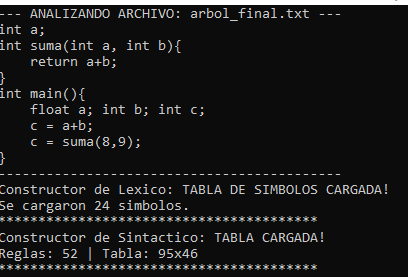
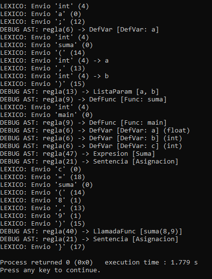

# Etapa: Generación del Árbol Sintáctico (AST)

Nota sobre el Código Fuente: La implementación completa del analizador sintáctico y las estructuras del árbol se encuentran centralizadas en el directorio principal: 

[Ir a ProyectoCompilador](aqui va la url)

---
## 1. Descripción de la Actividad
El objetivo de esta etapa final es validar la capacidad del compilador para construir el **Árbol de Sintaxis Abstracta (AST)**.
Se busca demostrar que el analizador sintáctico no solo valida la gramática, sino que construye en memoria dinámica los nodos correspondientes a estructuras complejas como:
* Definición de Funciones.
* Listas de Parámetros.
* Variables Locales y Globales.
* Llamadas a Función y Expresiones Aritméticas.

---

## 2. Código Fuente de Prueba
Para esta validación se utilizó el siguiente fragmento de código C++, conforme a lo solicitado en la especificación de la tarea:

```cpp
int a;

int suma(int a, int b){
    return a+b;
}

int main(){
    float a;
    int b;
    int c;
    c = a+b;
    c = suma(8,9);
}
```


# 3. Evidencia de Ejecución
A continuación se presentan las capturas de la ejecución del compilador procesando el código anterior.

Parte 1: Carga y Análisis Inicial
El sistema carga correctamente la Tabla de Símbolos y la Gramática (Reglas y Tabla LR) antes de iniciar el procesamiento del archivo fuente.

Parte 2: Construcción del Árbol (AST)
En la traza final se observa cómo el analizador identifica las estructuras gramaticales y construye los nodos específicos del árbol. Puntos clave a notar en la evidencia:






Definición de Función: DEBUG AST: regla(9) -> DefFunc [Func: suma]

Lista de Parámetros: DEBUG AST: regla(13) -> ListaParam [a, b]

Llamada a Función: DEBUG AST: regla(40) -> LlamadaFunc [suma(8,9)]
