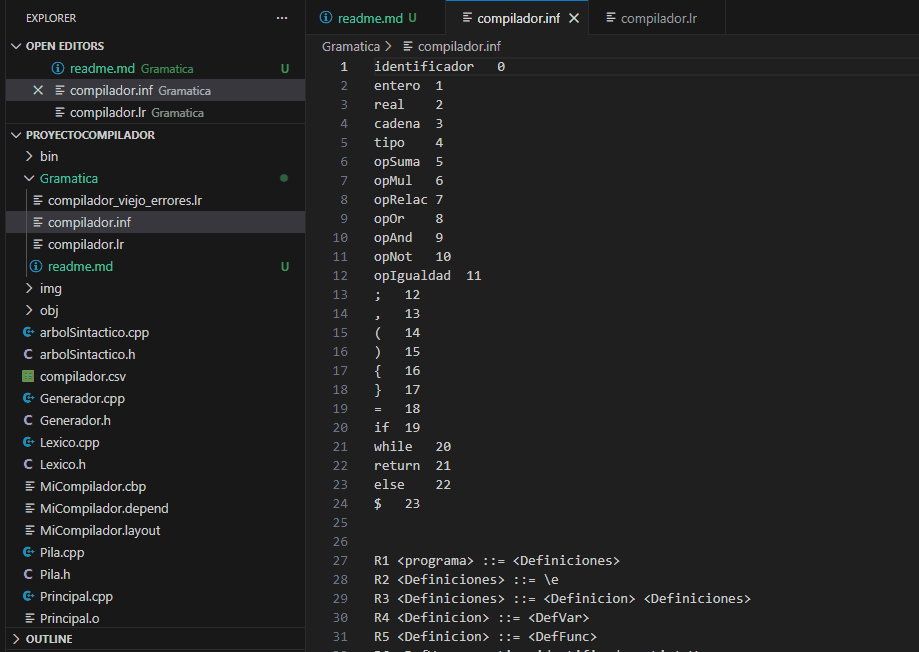
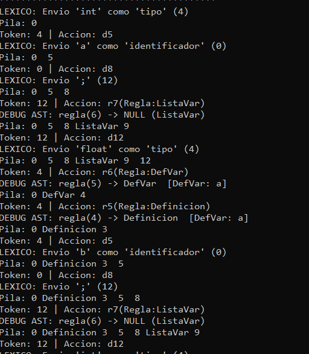
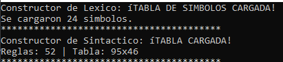
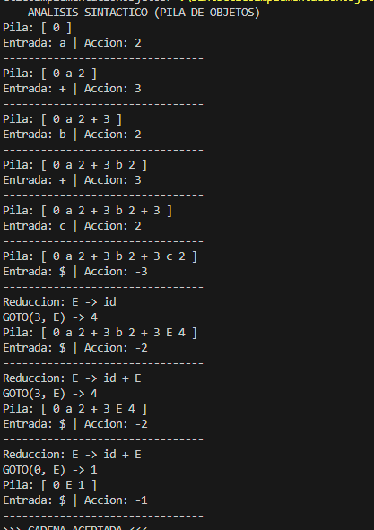

# Especificación e Implementación: Gramática del Compilador

**Estudiante:** Paola Guadalupe Espinoza  
**Materia:** Seminario de Solución de Problemas de Traductores de Lenguajes II  
**Arquitectura:** Híbrida (C++ / Python)

---

## 1. Descripción General
Este documento detalla la gramática utilizada por el compilador, así como el mecanismo de ingeniería de datos (ETL) implementado para cargar, validar y transformar dicha gramática desde archivos externos hacia el motor de análisis sintáctico.

---

## 2. Definición Formal (BNF)
El lenguaje se rige por una Gramática Libre de Contexto (GLC) definida en el archivo `compilador.inf`. A continuación se listan las producciones principales en notación BNF:



### Estructura Global y Declaraciones
* `R1  <programa> ::= <Definiciones>`
* `R4  <Definicion> ::= <DefVar> | <DefFunc>`
* `R6  <DefVar> ::= tipo identificador <ListaVar> ;`
* `R9  <DefFunc> ::= tipo identificador ( <Parametros> ) <BloqFunc>`

### Sentencias y Control de Flujo
* `R21 <Sentencia> ::= identificador = <Expresion> ;`
* `R22 <Sentencia> ::= if ( <Expresion> ) <SentenciaBloque> <Otro>`
* `R23 <Sentencia> ::= while ( <Expresion> ) <Bloque>`
* `R24 <Sentencia> ::= return <ValorRegresa> ;`

### Expresiones
* `R44-R47 <Expresion> ::= Operaciones Aritméticas (+, -, *, /)`
* `R48-R51 <Expresion> ::= Operaciones Lógicas y Relacionales (&&, ||, <, >)`

---

## 3. Arquitectura de Carga (Data Pipeline)
Para optimizar el rendimiento del motor C++, se utiliza un script auxiliar en **Python** que procesa la Tabla LR(1) cruda (exportada de Excel/CSV) y la convierte en una matriz numérica optimizada.

### Flujo de Datos
1.  **Entrada:** Archivo `compilador.csv` con acciones mixtas (`d5`, `r2`, `acc`).
2.  **Proceso:** Script Python (`cargador_tabla.py`) realiza limpieza y *type casting*.
3.  **Salida:** Matriz de enteros consumible por C++.

### Lógica de Conversión
El script aplica las siguientes reglas de transformación para normalizar la tabla:

| Valor CSV | Interpretación | Transformación |
| :--- | :--- | :--- |
| `d` + N | Desplazamiento | Entero Positivo (`N`) |
| `r` + N | Reducción | Entero Negativo (`-(N+1)`) |
| `acc` | Aceptación | `-1` |
| Vacío | Error | `0` |

---

## 4. Código del Cargador (Python)
A continuación se presenta la función crítica utilizada para la transformación de los datos de la gramática:

```python
import pandas as pd
def convertir_accion(valor):
    if pd.isna(valor) or valor == '': return 0
    valor = str(valor).strip()
    
    # Desplazamientos (Shift) -> Positivos
    if valor.startswith('d'): return int(valor[1:])
    
    # Aceptación -> -1
    if valor == 'r0' or valor == 'acc' or valor == 'acept': return -1
    
    # Reducciones (Reduce) -> Negativos
    if valor.startswith('r'):
        num_regla = int(valor[1:])
        return -(num_regla + 1)
        
    try: return int(float(valor))
    except: return 0
```

## 5. Evidencia de Ejecución y Carga
Se realizó una prueba completa de compilación. La siguiente evidencia demuestra:

* La correcta carga de la **Tabla de Símbolos** y la **Gramática** (Reglas y Tabla LR).





* El funcionamiento del **Árbol Sintáctico (AST)**, evidenciado por los mensajes de depuración (`DEBUG AST`) que muestran la construcción de nodos (`DefVar`, `Definicion`) durante las reducciones.





---
