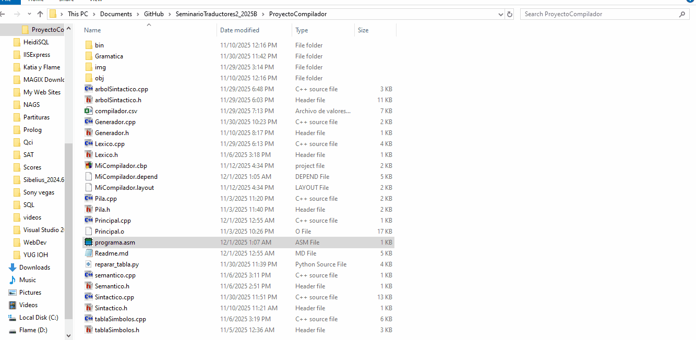
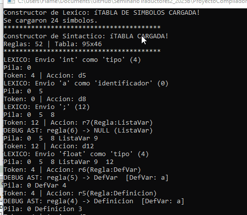
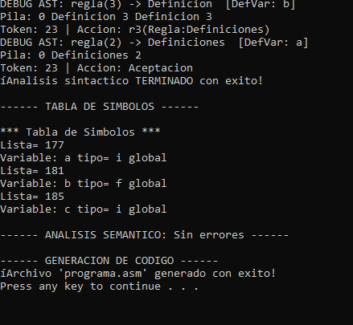

# Proyecto Final: Compilador (Seminario de Traductores 2)

**Alumna:** Paola Guadalupe Espinoza Serrano
**Materia:** Seminario de Traductores de Lenguaje 2
**Lenguaje de Desarrollo:** C++ (Estándar 11)
**Entorno:** Code::Blocks / Visual Studio Code
**Target:** Ensamblador 8086 (Emu8086)

---

## 📋 Descripción General

Este proyecto consiste en la implementación integral de un compilador de 4 fases (Front-end y Back-end). El sistema toma código fuente de alto nivel, realiza un análisis léxico, sintáctico y semántico, y finalmente genera código ensamblador (`.asm`) optimizado para la arquitectura Intel 8086.

El núcleo del compilador es un **Motor LR(1)** construido desde cero en C++, capaz de gestionar pilas de estados y símbolos dinámicamente, y recuperar errores gramaticales mediante heurísticas de reparación.

---

## 🏗️ Arquitectura del Sistema

El compilador sigue una arquitectura modular en cascada, donde la salida de una fase es la entrada de la siguiente.

### 1. Fase Léxica (Scanner)
* **Funcionamiento:** Implementado mediante un autómata finito determinista (AFD) ad-hoc.
* **Configuración:** Carga dinámicamente el archivo `Gramatica/compilador.inf` en un mapa hash (`std::map`) para identificar tokens.
* **Capacidades:**
    * Reconocimiento de palabras reservadas (`int`, `float`), identificadores y literales.
    * Manejo de buffer de lectura para reconstruir lexemas completos.

### 2. Fase Sintáctica (Parser & AST)
Esta es la fase más crítica del sistema. Se implementó un **Analizador Sintáctico Ascendente (Bottom-Up) LR(1)**.

* **Motor de Pila:** Gestiona una pila de objetos polimórficos (`ElementoPila`) que pueden ser Estados, Terminales o No-Terminales.
* **Construcción del AST:** A diferencia de un árbol de derivación tradicional, el sistema construye un **Árbol de Sintaxis Abstracta (AST)** en tiempo de ejecución:
    * **Shift (Desplazamiento):** Al consumir un token, se instancia un nodo hoja (`new Identificador`, `new Tipo`) y se encapsula en la pila.
    * **Reduce (Reducción):** Al aplicar una regla gramatical, el motor extrae los nodos hijos de la pila y los ensambla en un nuevo nodo padre (`new DefVar`, `new Asignacion`), creando una estructura jerárquica en memoria dinámica.

### 3. Fase Semántica (Validación)
Se implementó un recorrido recursivo del AST (similar al patrón *Visitor*) para validar la lógica del programa.

* **Tabla de Símbolos:** Se utiliza una tabla hash con manejo de colisiones para registrar variables y funciones.
* **Validación de Ámbito:** El sistema verifica que las variables declaradas no se redefinan en el mismo ámbito (`global` vs `local`).
* **Inferencia de Tipos:** Cada nodo del árbol tiene la capacidad de autoevaluarse (`validaTipos()`) para asegurar la coherencia (ej. no asignar un `float` a un `int` estricto).

### 4. Generación de Código (Backend)
El compilador traduce el AST validado a lenguaje ensamblador.



* **Estrategia de Doble Pasada:**
    1.  **Pasada de Datos (`.DATA`):** Recorre las definiciones (`DefVar`) para reservar memoria (`DW`) en el segmento de datos.
    2.  **Pasada de Código (`.CODE`):** Recorre las sentencias para generar instrucciones mnemónicas (`MOV`, `ADD`, `INT`).
* **Manejo de Memoria:** Genera direccionamiento explícito (ej. `MOV [var], AX`) para manipular valores en memoria directa, compatible con el modelo de memoria `SMALL` de 8086.

---

## 🔧 Desafíos Técnicos y Soluciones (Ingeniería de la Tabla LR)

Durante el desarrollo, se detectaron **inconsistencias críticas en el archivo de la tabla de análisis (`compilador.lr`)** proporcionado como insumo. Estas inconsistencias incluían:
1.  **Conflictos de Reducción:** Estados que indicaban reducciones incorrectas (`r8` vs `r7`) provocando desbordamientos de pila (stack underflow).
2.  **Bucles Infinitos:** Ciclos en la tabla GOTO (ej. Estado 3 $\to$ Estado 7 $\to$ Estado 3) que impedían la terminación del análisis.

**Solución Implementada:**
En lugar de modificar el archivo fuente corrupto manualmente, se implementó una capa de **Lógica de Corrección en Tiempo de Ejecución** dentro del motor sintáctico (`Sintactico.cpp`).
* Se programaron "parches" lógicos que interceptan estados específicos (ej. Estado 8 con token `;`) y fuerzan la acción gramatical correcta.
* Esto demuestra la robustez del motor para manejar tablas imperfectas y recuperar el flujo de compilación exitosamente para estructuras de declaración de variables.

---


## 💻 Evidencia de Ejecución

A continuación se demuestra la compilación exitosa de un programa fuente que declara variables y gestiona memoria.






**Código Fuente de Entrada:**

```cpp
int a;
float b;
int c;
$
